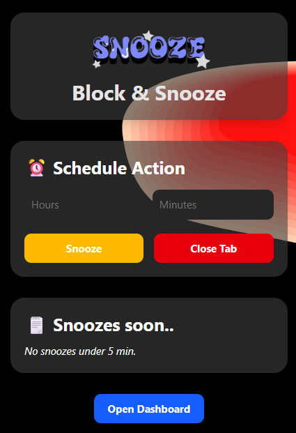
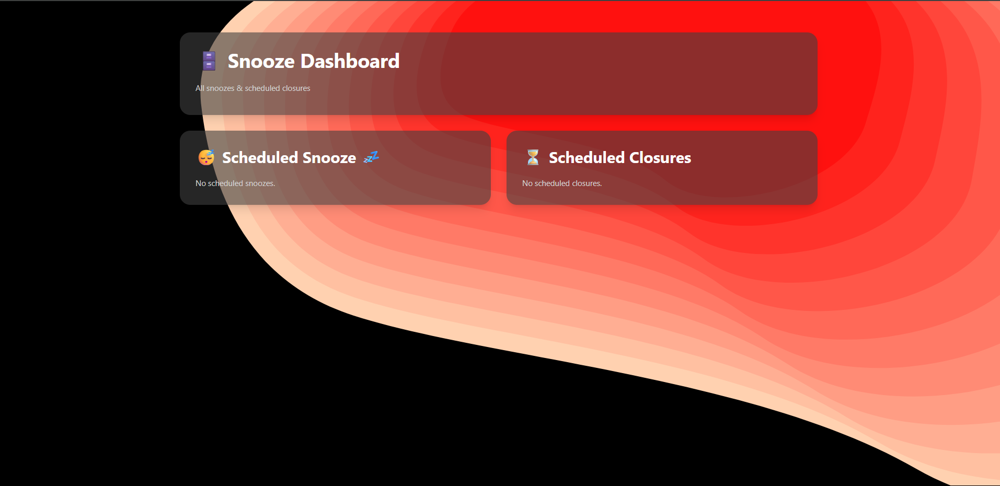
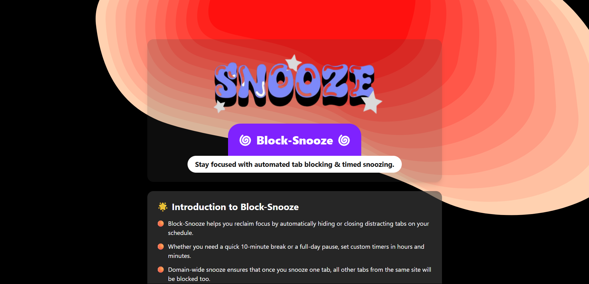

<p align="center">
  
</p>

# 🌀 Block-Snooze: Own Your Focus, One Tab at a Time

**Block-Snooze** is a lightweight Chrome extension designed to help you reclaim your attention. Automatically hide or close distracting tabs on a precise schedule—down to the hour and minute—and domain-wide snoozing ensures a single action keeps all related tabs out of your way. When your timer expires, tabs reopen or close automatically, so you stay on track without lifting a finger.

---

## 🌟 Popup

<p align="center">
  
</p>

---

## 🔥 Key Features

- **⌛ Flexible Scheduling**  
  Set timers in hours & minutes (up to days) for both snoozing and closing tabs—perfect for any workflow.

- **🔒 Domain-Wide Blocking**  
  Snooze one instance of a site (e.g., YouTube) and **every** tab from that domain is hidden or closed.

- **📊 Central Dashboard**  
  Your one-stop view of all active snoozes and scheduled closures, complete with live countdowns and remove/unsnooze controls.

- **🔔 Notifications**  
  Receive clear alerts moments before any tab hides, reopens, or closes—so you’re never caught off guard.

- **🔧 One-Click UI**  
  Manage and configure all your timers from a simple, distraction-free toolbar popup.

- **🛡️ Privacy-First**  
  All functionality runs locally in your browser; no data is ever sent to external servers.

---

## 🚀 Dashboard

<p align="center">
  
</p>

---

## 🎓 Onboarding

<p align="center">
  
</p>

---

## 🛠️ Installation

### From the Chrome Web Store

1. Visit the [Chrome Web Store listing][chrome-store].
2. Click **Add to Chrome** → **Add extension**.
3. You’ll see the 🌀 Block-Snooze icon in your toolbar.

### From Source (Developer Mode)

```bash
git clone https://github.com/your-username/block-snooze.git
cd block-snooze
```

## 📖 Usage

1. **Open the popup** by clicking the 🌀 icon in your toolbar.
2. **Enter your duration** in hours & minutes.
3. **Click Snooze** to immediately hide/close tabs domain-wide, or **Close Tab** to schedule a future close.
4. **Visit the Dashboard** anytime to view live countdowns, remove timers, or unsnooze tabs.

---

## 💡 Pro Tips

- **Batch your workflows:** Group related tabs (e.g., research) and snooze them together for focused blocks.
- **Use domain snooze:** One snooze blocks all tabs on that domain—ideal for social media or news sites.
- **Check your Dashboard regularly:** Stay ahead of reopening tabs so you’re never surprised.
- **Cancel unneeded timers:** Keep your environment clean by removing old snoozes.

---

## 🤝 Contributing

We love pull requests! To contribute:

1. Fork this repository.
2. Create a branch:
   ```bash
   git checkout -b feature/my-new-feature
   ```

---

## 📜 License

License MIT © suresh choudhary

---

## 👤 Author

**Suresh** — like's building things.

- GitHub: [sschoudhary30](https://github.com/sschoudhary30)
- LinkedIn: [sschoudhary30](https://www.linkedin.com/in/sschoudhary30)

---

_Stay focused, stay productive!_
